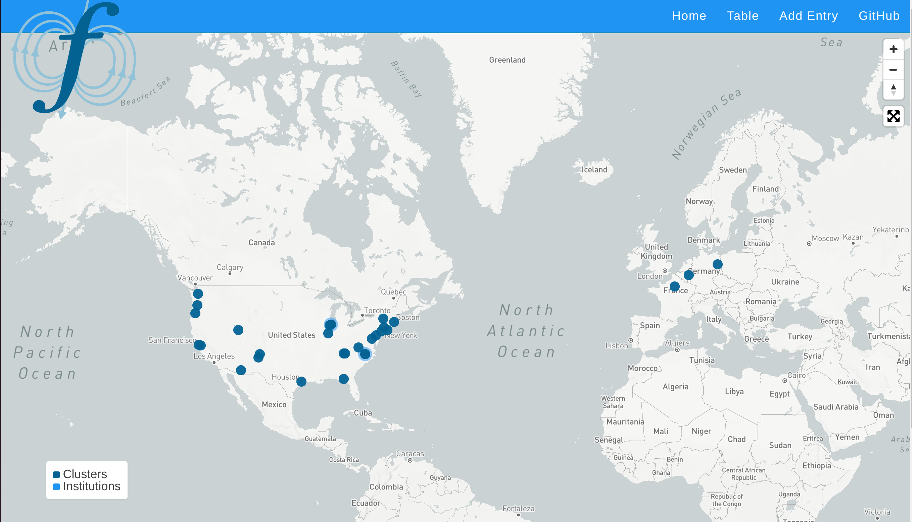

# The Flux Framework Locator Map

These are centers or institutions that reported using Flux. We will update this repository (and the map) with exactly what the means soon. The original list was assembled (primarily through email correspondence) for the R&D 100 award, and the map will be updated with new centers into the future. We currently have automation disabled pending discussion about design.



## How does it work?

The form that is provided [on the site](https://flux-framework.org/locator-map/) is fed into Google 
Sheets, and the workflow to [.github/workflows/update-map.yml](.github/workflows/update-map.yml) is able to
parse the sheet for locations and then update the map! In addition to spot checks of the
sheet, during the addition we have an automated workflow that checks any provided url for:

 - spam
 - phishing
 - suspicious
 - adult content
 - malware
 
And we keep a cache of scanned (and determined safe) URL entries in [scripts/scanned-urls.txt](scripts/scanned-urls.txt),
the reason being that the free tier of the API only allows 5K calls per month, and we want to use those wisely!
We use [this API](https://www.ipqualityscore.com/documentation/malicious-url-scanner-api/overview), and the token for
scanning is provided in the GitHub repository action. Keep in mind if you run the update locally
without a token, you will not be checking URLs and should do it manually. If any detection is made,
the workflow is cancelled and the offending entry can then be removed from the sheet.
Here is what an example response looks like:

```console
{
    "message": "Success.",
    "success": true,
    "unsafe": false,
    "domain": "github.com",
    "ip_address": "140.82.114.4",
    "server": "GitHub.com",
    "content_type": "text/html; charset=utf-8",
    "status_code": 200,
    "page_size": 23542,
    "domain_rank": 37,
    "dns_valid": true,
    "parking": false,
    "spamming": false,
    "malware": false,
    "phishing": false,
    "suspicious": false,
    "adult": false,
    "risk_score": 0,
    "category": "Computers & internet",
    "domain_age": {
        "human": "15 years ago",
        "timestamp": 1191954050,
        "iso": "2007-10-09T14:20:50-04:00"
    },
    "request_id": "98VQ5x8beq"
}
```

Very cool!

## Development

You can test running the scripts locally! First, prepare a python environment:

```bash
$ python -m venv env
$ source env/bin/activate
```

And install dependencies:

```bash
$ pip install -r scripts/requirements.txt
```

You can then run the script directly:

```bash
$ python scripts/update_map.py
```

This automation runs nightly to update our map. But we aren't perfect, and sometimes
the data going into the form is not perfect! If you see a problem, please [open an issue](https://github.com/flux-framework/locator-map/issues).

## 🎨️ Thanks 🎨️

The Flux Framework Center map is derived from [the HPC.social map](https://github.com/hpc-social/map), which is derived from the [US-RSE Map](https://us-rse.org/usrse-map), both of which were designed and implemented by [@vsoch](https://github.com/vsoch).
